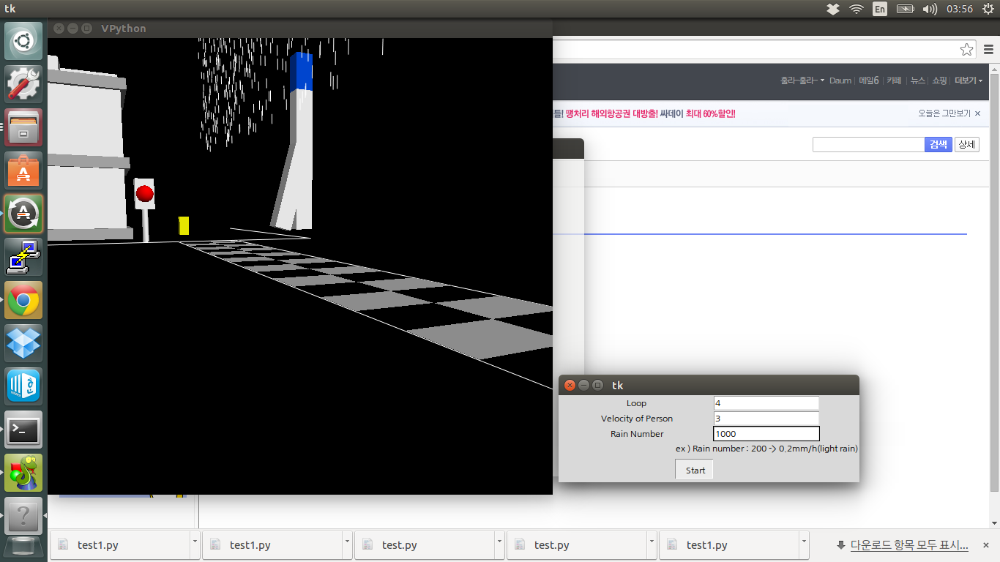

# Visual Physics Project

This is a simulation for raindrop when you cross a road at university of seoul. I had a question that do I get less wet walking or running in the rain. So I made this simulation with python and visual module.

## Idea

### Make a yellow box(person)

A yellow box means walking person. You can change velocity.

### Raindrop

Randomly raindrops are made in the sky.

### Count

If raindrop pass through yellow box, 1 count.

### Screenshot

<figure>
  
  
<em>Raindropt screenshot</em>

</figure>